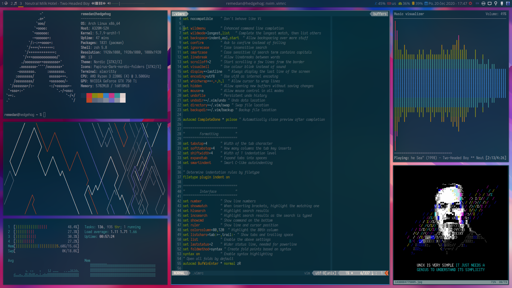

# ~/dotfiles

I use [dotdrop](https://github.com/deadc0de6/dotdrop) to manage my dotfiles. Everything can be installed like so:

```
git submodule update --init
pip3 install -r dotdrop/requirements.txt
./dotdrop/bootstrap.sh
./dotdrop.sh install
```

## Configuration

A few variables can be set in `config.yaml`.

* `colorscheme`: System-wide color scheme. Possible values are `solarized-dark`, `gruvbox-dark`, `dracula` and `nord`.
* `browser`: Default browser to be used by various applications to open links.

## Screenshot



## Key Components and Software

* [i3-gaps](https://github.com/Airblader/i3) + Polybar + Picom
* alacritty + zsh + Oh My Zsh
* Neovim (0.5 or later)
* Ranger
* Rofi
* dunst
* mpd + ncmpcpp
* sxiv, mpv, zathura
* WeeChat

### Fonts

My two favourite programming fonts are [Iosevka](https://typeof.net/Iosevka/) and [Terminus](http://terminus-font.sourceforge.net/). I also use Nerd Fonts for icons.

### Git user config

To keep my git user info from this repo I source it from `~/.config/git/user`. Git will complain if it doesn't exist. Example contents:

```
[user]
    name = "John Doe"
    email = "jd@example.org"
    signingkey = "ABC123DEF456"
```
